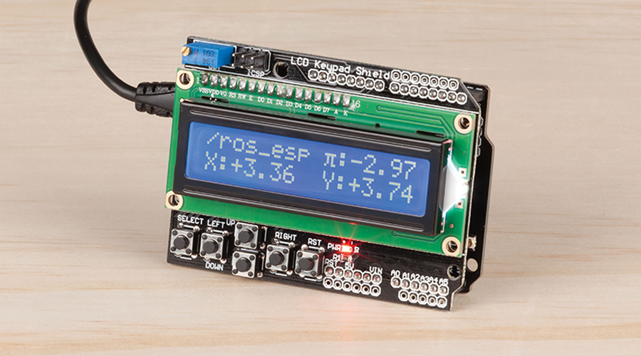
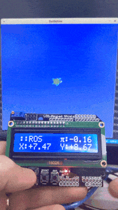

# Micro ROS Controller
 Control your ROS projects with a simple to build controller

Ever build robots and looking for a neat way to control them? Or have you heard of the Robotic Operating System (ROS) but didn't know where to begin? Then have a look at our new project utilising our popular [XC4411](https://jaycar.com.au/p/XC4411) Uno with WIFI board and LCD controller ([XC4454](https://jaycar.com.au/p/XC4454)).

This tutorial gives you everything you need to set up a ROS environment on your PC and builds a small controller which you can use to control a simulator around on the page. Once you've built it, you can easily transport the controller to control any other ROS robot with a flick of a command. The possibilities are endless.

## Bill of materials

| Qty | Code     | Description                |
| --- | -------- | -------------------------- |
| 1   | [XC4411](https://jaycar.com.au/p/XC4411) | UNO with wifi              |
| 1   | [XC4454](https://jaycar.com.au/p/XC4454) | LCD module 2x16 controller |

### Additional ideas

| Code     | What it is           | What to use it for                                                           |
| -------- | -------------------- | ---------------------------------------------------------------------------- |
| [XC3734](https://jaycar.com.au/p/XC3734) | Slider Potentiometer | things like throttles, or analogue movement between an upper and lower bound |
| [SR1230](https://jaycar.com.au/p/SR1230) | Rotary encoder       | Used for infinite turning motion                                             |
| [XC3732](https://jaycar.com.au/p/XC3732) | 3 axis tilt sensor   | controler orientation detection                                              |
| [XC4630](https://jaycar.com.au/p/XC4630) | Touch screen         | create your own easy GUI interface, in a portable way.                       |

## Understanding ROS2

`ROS2` is a collection of _middleware_ programs designed for making modular components: Rather than developing a camera system on your robot that has to be re-created for every other robot; you should just be able to `sudo apt install ros2-camera-system` and plug it together with a simple script..

.. Well that's the theory, anyway. There's a lot of robots out there, a lot of components that all need to be hooked up in some way, and a lot of code that needs to be maintained. This is largely done in an open-source manner, headed by the ros group. You can find more information about ROS and its workings here: https://index.ros.org/doc/ros2/

## Building the Micro-Ros-Controller project

 For a complete breakdown of how it works, check out website at https://jaycar.com.au/ros-controller 

## Use

The use of this is completely up to you, but you can see in the video above I just made a simple switch between the 4 buttons and moving the turtle around. In this example, the buttons are sent via UDP and the position / `pose` of the robot is sent via TCP; this is for both button/reaction speed and for quality of information coming back to the controller.

Try it out and let us know what you build with it; we'd really love to see more ROS2 robots out there, and thanks to RViz and other simulators, it's easy to build robots in simulators, and try to connect it up with real hardware, somewhat similar to what we've done here.

The absolute best way to learn is to just try to write your own software and use this as a bit of a guide; you can then tailor the system to what you have available for you, and perhaps you might have better ideas on how to communicate between the ROS and microcontroller ecosystems.

We're welcoming contributions on this code base, as it's fairly unmaintable at the moment: if you find that something is not clear, or you want more pictures, or you want to change the code, feel free to submit PR and Issues.
